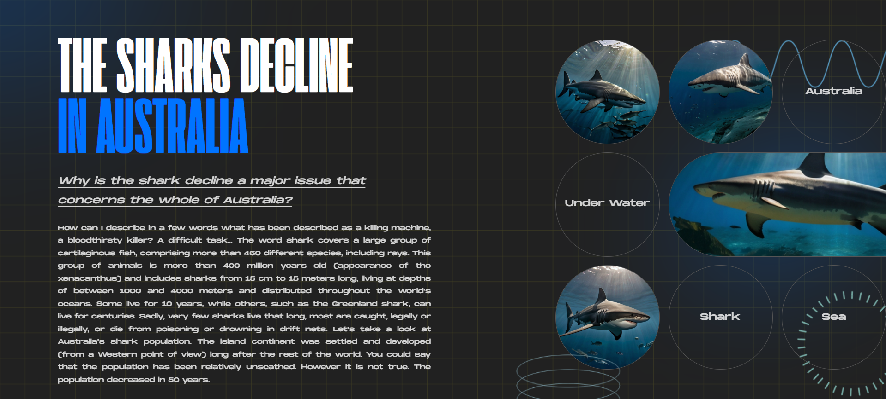
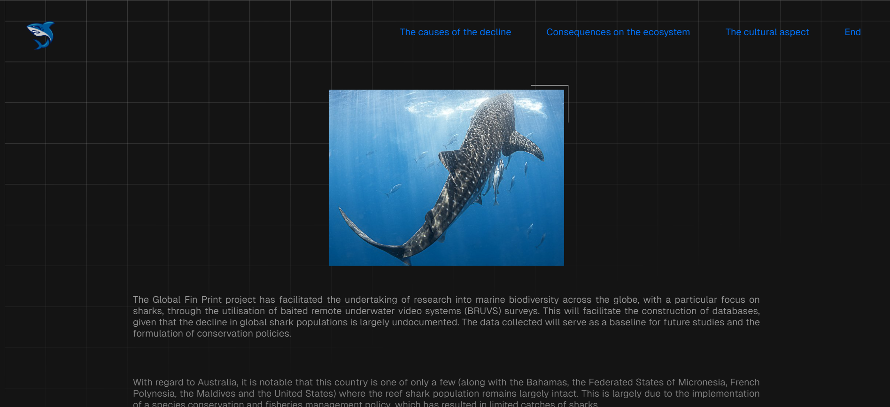
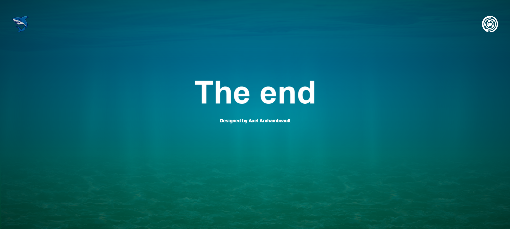

## 📌 Présentation

**Shark Marina** est un site web éducatif regroupant différentes **synthèses d’articles scientifiques rédigées en anglais** à propos des requins.

Le projet vise à **rendre les données scientifiques plus accessibles** grâce à un travail de **vulgarisation scientifique**, tout en sensibilisant les visiteurs à **l’évolution des populations de requins** ainsi qu’à leur **importance culturelle en Australie**.

Ce site a été réalisé dans le cadre d’un projet de **Section Internationale Australienne (SIA)** lors de la préparation du **Baccalauréat français**.

🌐 Site du projet :  
https://shark-marina.vercel.app/

---

## 🎯 Objectifs du projet

- 📚 Rendre les **données scientifiques accessibles**
- 🧠 Encourager la **vulgarisation scientifique**
- 🦈 Sensibiliser à **l’évolution des populations de requins**
- 🐨 Mettre en avant **l’impact culturel des requins en Australie**
- 🎨 Proposer une **expérience visuelle immersive et pédagogique**

---

## 🛠️ Technologies utilisées

Le site a été développé avec des **technologies web fondamentales**, afin de se concentrer principalement sur **le design et l'expérience utilisateur**.

- **HTML**
- **CSS**
- **JavaScript**

---

## ✨ Fonctionnalités

- 📄 Synthèses d’articles scientifiques
- 🎨 Interface visuelle avec animations
- 📱 Design responsive
- 🦈 Contenu éducatif sur les requins
- 🧭 Navigation simple et intuitive

---

## 📸 Captures d’écran

*(Ajoute ici des captures d’écran du site plus tard)*

### Page d’accueil

### Page d’article

### Page de fin

---

## 🎓 Contexte du projet

Ce projet a été réalisé en **2024** dans le cadre de la **Section Internationale Australienne (SIA)**, en parallèle de la préparation du **Baccalauréat français**.

Il combine :

- recherche scientifique  
- rédaction académique en anglais  
- développement web  
- communication pédagogique

---

## 👥 Auteurs

**Axel Archambeault**  
💻 Développement du site

**Marina Soland Ruillier**  
📚 Recherche scientifique et collaboration

---

